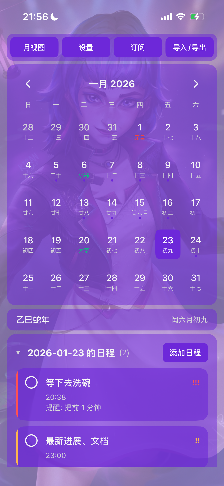
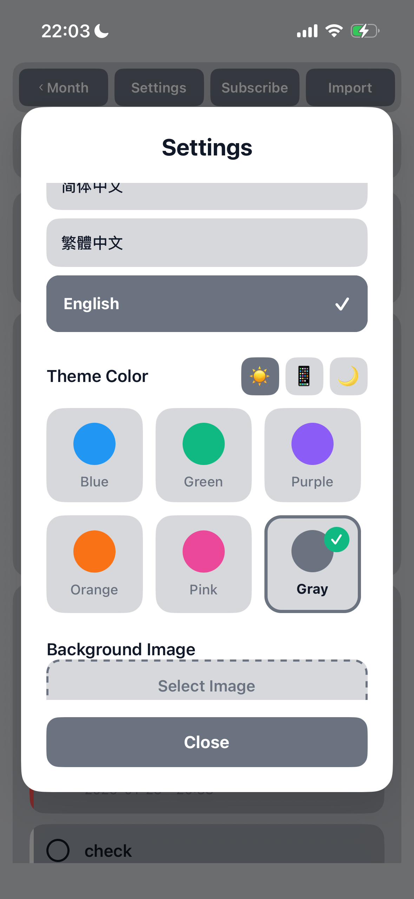
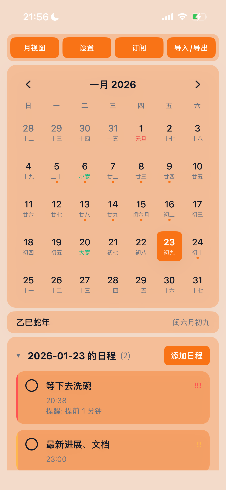
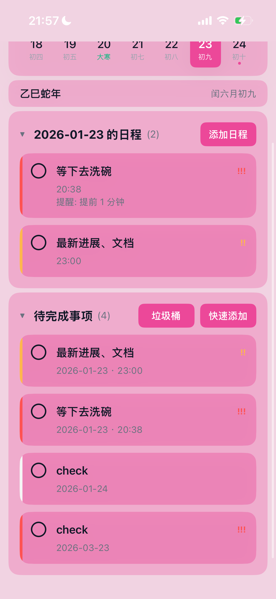
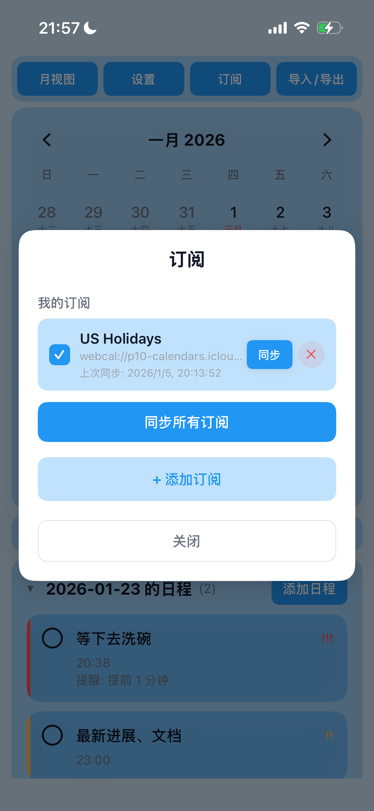
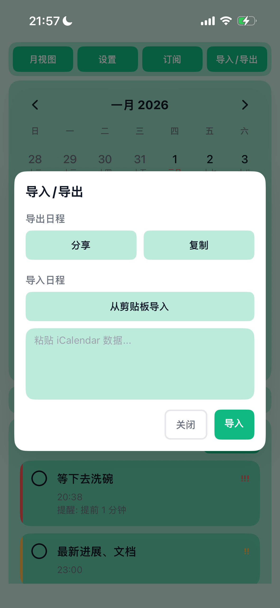

# DayMate

<div align="center">
  
</div>

**Your Personal Calendar Companion**

[中文文档](./docs/README-CN.md)

A cross-platform calendar application for everyday and professional use. DayMate uses a Monorepo architecture, supporting both Android native and React Native cross-platform apps, with intuitive calendar views and flexible event management at its core.

> **Note**: Current development focus is on the React Native side. The Android native app shares core modules (event models, lunar calendar, etc.) but has limited UI feature parity for now.

## Architecture Overview

DayMate adopts a Monorepo architecture with the following modules:

```
DayMate/
├── apps/
│   ├── android-calendar/    # Android native app
│   └── rn-calendar/         # React Native cross-platform app
├── shared/
│   ├── core/                # Shared core business logic
│   └── ui-android/          # Android UI components
├── packages/                # Shared packages (lunar calendar, etc.)
└── docs/                    # Documentation
```

## Screenshots

<div align="center">
  
  
  
  
  
  
</div>

## Core Features

### Multi-Platform Support
- **Android Native**: Full Material Design experience
- **React Native**: iOS & Android cross-platform support
- **Shared Core**: Unified business logic and data models

### Rich Calendar Views
- Month View: Overview of monthly schedules
- Week View: Focus on weekly plans
- Day View: Detailed single-day timeline
- Quick switching between views

### Smart Reminders
- Local notification reminders
- Multiple advance reminder options
- Auto-rebuild reminders after device reboot

### Trash Bin
- Deleted events go to trash instead of permanent deletion
- Auto-cleanup after 30 days
- Restore or permanently delete at any time

### Calendar Subscription
- Subscribe to external calendars via webcal:// or https://
- Supports ICS format calendar feeds
- Configurable sync frequency
- Auto-add events after subscription

### Dark & Light Mode
- System-following mode
- Manual light mode
- Manual dark mode
- Theme color customization

### Standards Compliance
- RFC5545/ICS import & export support
- Compatible with Google Calendar, Outlook, etc.
- Network subscription support (webcal/https)

### Lunar Calendar Support
- Built-in Chinese lunar date display
- Solar terms and traditional festivals
- Optimized for Chinese users

### Internationalization
- Full i18n support
- English and Chinese interfaces
- Easily extensible for other languages

## Quick Start

### Requirements

- **Android Development**: JDK 17+, Android Studio Hedgehog+, Android SDK 34
- **React Native**: Node.js 16+, npm/yarn/pnpm
- **iOS Development**: Xcode 14+, CocoaPods

### Build Android App

```bash
# Clone repository
git clone https://github.com/ceilf6/DayMate.git
cd DayMate

# Build and install
./gradlew :apps:android-calendar:installDebug
```

### Run React Native App

```bash
# Enter RN directory
cd apps/rn-calendar

# Install dependencies
npm install

# Run Android
npm run android

# Run iOS
npm run ios
```

## Documentation

- [Architecture](./docs/ARCHITECTURE.md) - Monorepo architecture design
- [Development Guide](./docs/DEVELOPMENT.md) - Development environment setup
- [Migration Guide](./docs/MIGRATION.md) - Migration to Monorepo
- [I18n Guide](./docs/I18N_GUIDE.md) - Internationalization guide
- [Usage Guide](./docs/USAGE_GUIDE.md) - User guide

## Use Cases

- Personal time management: Schedule meetings, tasks, and todos
- Family shared calendar: Export/subscribe calendars to share
- Cross-platform usage: Seamless switching between Android and iOS
- Import historical events: Batch import from ICS files
- Subscribe to external calendars: Public holidays, team schedules, etc.

## Tech Stack

### Android Native
- Kotlin
- Jetpack (Room, ViewModel, LiveData, Navigation, WorkManager)
- Material Design 3
- Coroutines & Flow

### React Native
- TypeScript
- React Navigation
- AsyncStorage / SQLite
- React Native Calendars

### Shared Layer
- Kotlin (shared core logic)
- Gradle Multi-Project
- Room Database

## Testing

```bash
# Android unit tests
./gradlew :shared:core:test
./gradlew :apps:android-calendar:test

# React Native tests
cd apps/rn-calendar
npm test
```

## Feature Overview

### Calendar Views
- Month / Week / Day view switching
- Event preview, multi-day events, and all-day events display

### Event Management
- Create / Edit / Delete events
- Recurrence rules with end conditions
- Multiple reminder rules (e.g., 30 min before, 10 min before)
- Swipe to complete or delete events
- Trash bin for deleted events recovery

### Import & Export
- ICS file import (RFC5545 parsing)
- ICS export for backup or sharing

### Calendar Subscription
- Support webcal:// and https:// subscription URLs
- Background periodic sync (configurable)
- Auto-add subscribed events to calendar

### Localization
- Chinese lunar dates and solar terms
- Localized date/time formats
- Multi-language UI support

## Architecture & Implementation

- **Platform**: Android (Kotlin + AndroidX) / React Native (TypeScript)
- **Data Storage**: Local database (Room / AsyncStorage) for events and subscription metadata
- **Background Tasks**: WorkManager for subscription sync and reminder rebuilding
- **Notifications**: System notifications with permission handling for Android 13+

## Permissions & Privacy

### Required Permissions
- **INTERNET**: For calendar subscription and network import
- **POST_NOTIFICATIONS** (Android 13+): Local reminder notifications
- **RECEIVE_BOOT_COMPLETED**: Rebuild reminders after device restart
- **Storage Access**: SAF (Storage Access Framework) for import/export

### Privacy
- Data is stored locally by default, not sent to third-party servers
- Subscription feature connects to provided URLs only
- Credentials for private subscriptions are stored locally

## Import/Export & Subscription Guide

### Import ICS File
1. Go to Settings > Import
2. Select an ICS file
3. App parses RFC5545 events with conflict handling

### Export to ICS
Select events or calendar to export as standard ICS file for backup or sharing.

### Subscribe to Calendar
1. Go to Subscription settings
2. Enter webcal:// or https:// URL
3. Configure sync frequency
4. Events auto-sync to your calendar

## FAQ

**Q: Time offset after import?**
A: Check the VTIMEZONE declaration in the imported file and device timezone settings.

**Q: Subscription not updating?**
A: Verify the subscription URL is valid, check sync frequency settings, and network connectivity.

**Q: How to recover deleted events?**
A: Open the Trash bin from settings, find the event, and tap Restore.

## Contributing

Issues, PRs, and feature suggestions are welcome!

1. Fork the repository
2. Create a branch for your feature or fix
3. Submit a PR with description and test steps

## License

See the `LICENSE` file in the repository root.

## Roadmap

- Enhanced recurrence rule editing UI
- Improved ICS import compatibility
- Cloud sync options (optional)
- Shared calendar editing permissions
- Smart schedule recommendations

---

Thank you for using DayMate! For demos or custom features, please open an issue.
